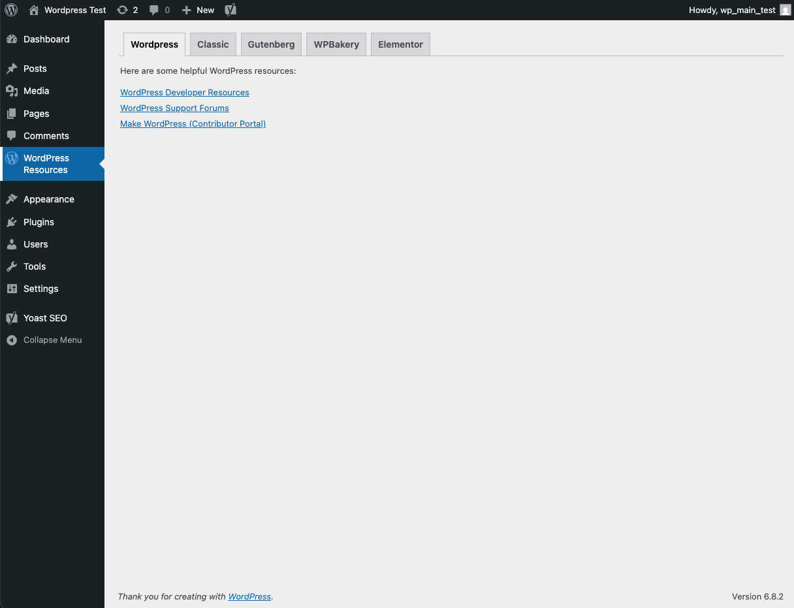

# 404 Broken Internal Links

## 📖 Description

**XnY 404 Broken Internal Links** - A comprehensive WordPress plugin that automatically detects and manages broken internal links to improve SEO and user experience. Built by XnY (Weng Fei Fung).

**Core Capabilities:**
• **Automated Link Scanning** - Deep scan of all internal links with configurable depth and limits
• **Real-time Progress Tracking** - Live monitoring with detailed statistics during background processing  
• **Advanced Reporting** - Filterable, searchable results table with status codes and error details
• **Link Management Tools** - Fix, replace, or ignore broken links through intuitive modal interfaces
• **CSV Export** - Export detailed scan results for external analysis and record-keeping
• **Modern Admin Interface** - AJAX-powered tabbed dashboard with animations and responsive design

Perfect for agencies, freelancers, and site owners maintaining link integrity across WordPress websites.

---

**📚 Documentation:**
- [`context.md`](context.md) - Complete development context and architecture overview
- [`context-features.md`](context-features.md) - Detailed feature analysis and UI components

---

## ⚡ Installation

1. Upload the plugin files to:  
   `/wp-content/plugins/xny-404-internal-links/`
2. Or install directly through the **WordPress Plugins screen**.
3. Activate the plugin through the **Plugins screen** in WordPress.
4. Find the **404 by XnY** menu in your WordPress admin sidebar.

---

## ❓ FAQ

### How does the link scanning work?
The plugin crawls through your WordPress site's content (pages, posts, and other content types) to identify all internal links. It then tests each link to determine if it returns a 404 error or other issues. The scanning process runs in the background and provides real-time progress updates.

### Will this plugin slow down my website?
No. The scanning process only runs when you manually initiate it from the admin dashboard. It doesn't affect your site's frontend performance or loading speed for visitors.

### Can I schedule automatic scans?
Currently, scans must be initiated manually. Automatic scheduling features are planned for a future update and will be available in the plugin settings.

### What types of links are checked?
The plugin focuses on internal links within your WordPress site. It can optionally check external links as well, but the primary focus is on identifying broken internal navigation that affects SEO and user experience.

### How do I fix broken links found by the plugin?
The plugin provides several options for each broken link: replace the link with a correct URL, remove the link entirely, or mark it to be ignored. The fix functionality is currently being enhanced for the next version.

---

## 📜 Changelog

### 1.0.0
- Initial release of 404 Broken Internal Links plugin
- Automated internal link scanning functionality
- Real-time scan progress tracking with detailed statistics
- Comprehensive broken links reporting with filtering and search
- Link management tools (fix, replace, ignore options)
- CSV export functionality for scan results
- Modern, responsive admin interface with tabbed navigation
- Database integration for scan history and results storage

---

## 🔔 Upgrade Notice

### 1.0.0
First release — comprehensive internal link scanning and management for WordPress sites.

---

## 🖼️ Screenshots

1. **Dashboard Overview** - Main plugin dashboard with navigation and quick stats

2. **Link Scanning Interface** - Configure and monitor link scans in real-time

3. **Broken Links Report** - Detailed table of all broken links with management options

4. **Settings Panel** - Plugin configuration and upcoming features preview

---

## 🏷️ Tags
`404 errors`, `broken links`, `internal links`, `SEO`, `link checker`, `website maintenance`
